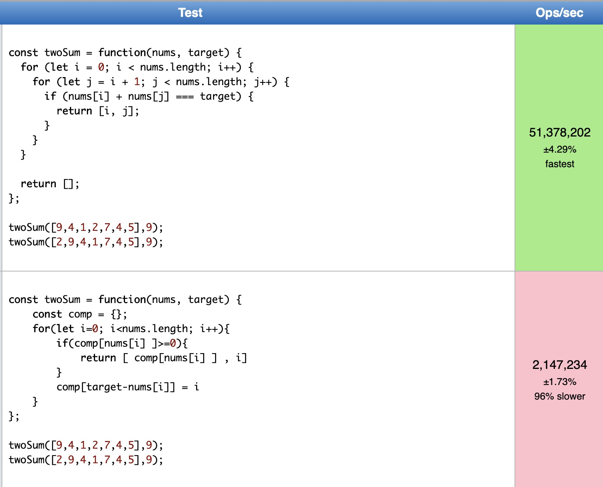

# Two Sum

Given an array of integers, return indices of the two numbers such that they add up to a specific target.

```
Give nums = [2, 7, 11, 15], target = 9,
Because nums[0] + nums[1] = 2 + 7 = 0,
return [0, 1]
```
## Thoughts 1

Using brute force approach

```javascript
const twoSum = (nums, target) => {
  const l = nums.length
  for (let i = 0; i < l; i++) {
    for (let j = l - 1; j >= 0; j--) {
      if (nums[i] + nums[j] === target) {
        if (i !== j) return [i, j]
      }
    }
  }
}
```
Complexity: `O(n^2)`

## Thoughts 2

Using hash table

```javascript
const twoSum = (nums, target) => {
  const map = {}
  const l = nums.length
  for (let i = 0; i < l; i++) {
    if (map[nums[i]] >= 0) {
      return [map[nums[i]], i]
    }
    map[target - nums[i]] = i
  }
}
```
Complexity: `O(n)`

## Performance

Regardless the complexity of Big O notation, for some reasons, burte force approach runs faster than hash table approach, this might caused by browser rendering, language mechanism, etc.


*img credit from leetcode community*

I will try to dig up and see what caused it exactly, the Big O Notation applies thoroughly in general.