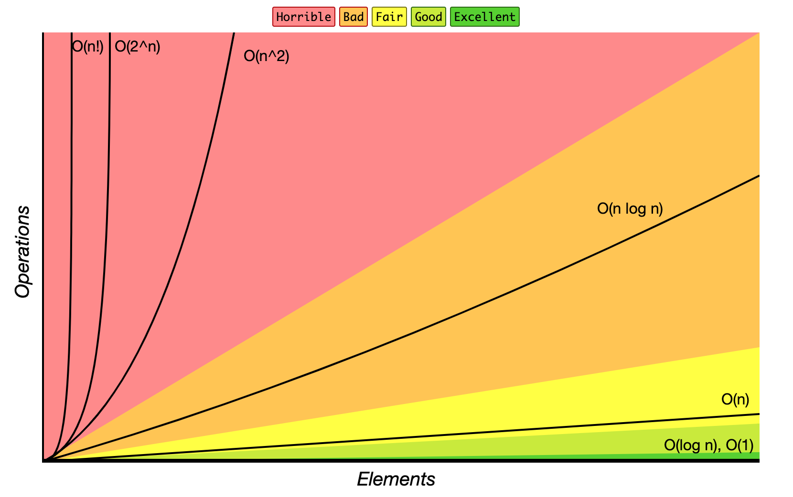
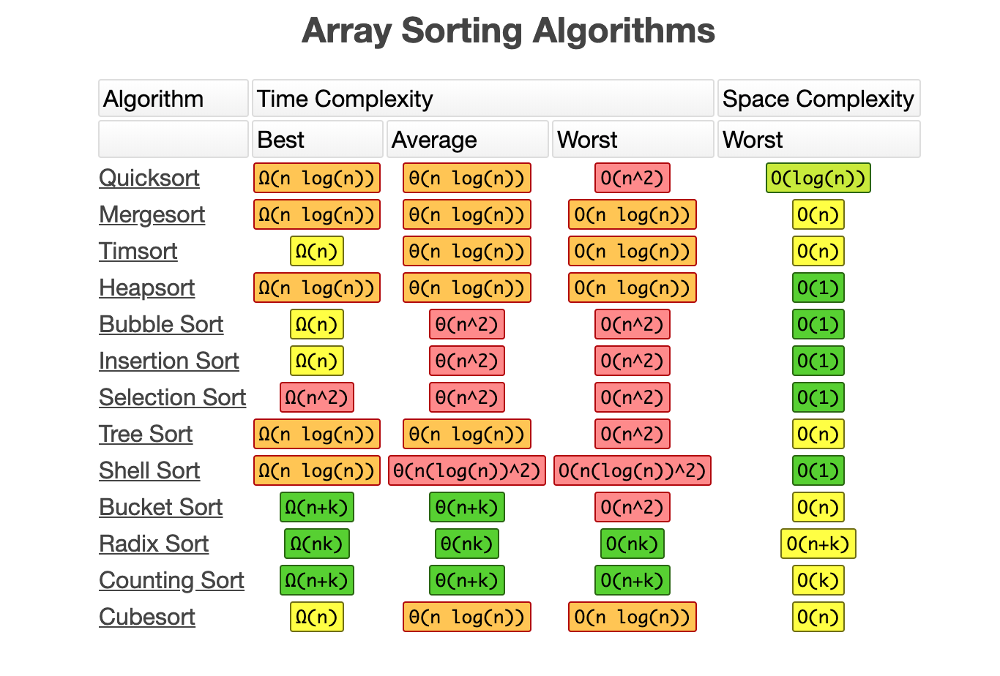

# Time and Space Complexity

In computer science, the time complexity is the computational complexity that describes the amount of time takes to run an algorithm. Time complexity is commonly estimated by counting the number of elementary operations performed by the algorithm, supposing that each elementary operation takes a fixed amount of time to perform. Thus, the amount of time taken and the number of elementary operations performed by the algorithms are taken to differ by at most a constant factor.

Since an algorithm's running time may vary among different inputs of the same size, one commonly considers the worst-case time complexity, which is the maximum amount of time required for inputs of a given size. Less common, and usually specified explicitly, is the average-case complexity, which is the average of the time taken on inputs of a given size. In both cases, the time complexity is generally expressed as a function of the size of the input. Since this function is generally difficult to compute exactly, and the running time for small inputs is usually not consequential, one commonly focuses on the behavior of the complexity when the input size increases - that is, the asymptotic behavior of the complexity. Therefore, the time complexity is commonly expressed using big O notation.

### Big O Notation Complexity Chart

### Big O Table of Sorting

## References

* https://en.wikipedia.org/wiki/Time_complexity
* https://www.bigocheatsheet.com/